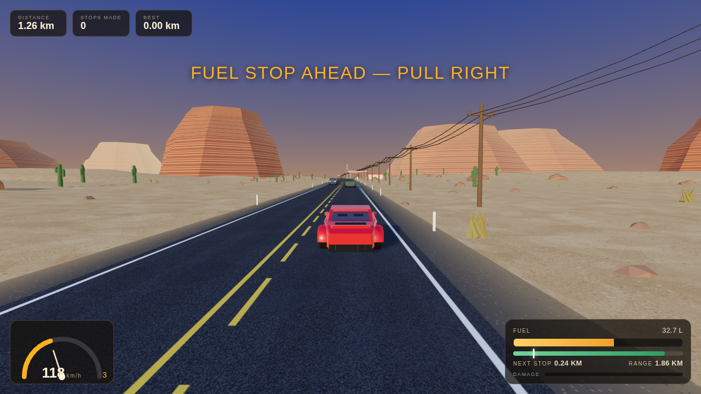

# Desert Run — Fuel or Die

A 3D driving game set on an endless American desert highway. Pick a car, watch
the fuel gauge, and **stop at every gas station** — the tank never holds enough
to reach the one after next. Miss a stop and you die out there.



Built with [three.js](https://threejs.org/) and nothing else: no build step, no
downloads, no art assets. Every texture, car, cactus and mesa is generated in
code at load time.

**English and Spanish** — the game picks your browser's language and there is an
EN/ES switch in the garage and on the pause screen. *(Español: ver
[abajo](#español).)*

## Play

The game is plain ES modules, so it needs to be served over HTTP (opening
`index.html` from the file system will not work — browsers block module
imports on `file://`).

```bash
git clone https://github.com/Mauro-Garcia2012/Car-game.git
cd Car-game
python3 -m http.server 8080      # or: npx http-server -p 8080
```

Then open <http://localhost:8080>. It also works as-is on GitHub Pages or any
static host.

## Controls

| Action | Keyboard | Gamepad |
| --- | --- | --- |
| Accelerate | `W` / `↑` | Right trigger |
| Brake / reverse | `S` / `↓` | Left trigger |
| Steer | `A` `D` / `←` `→` | Left stick |
| Handbrake | `Space` / `Shift` | `A` |
| Camera (chase / bonnet / orbit) | `C` | |
| Pause | `P` or `Esc` | |
| Restart | `R` | |
| Mute | `M` | |

On phones and tablets, on-screen pedals and steering buttons appear
automatically.

## The rules

- Gas stations sit **1.95–2.47 km apart** along the highway. A full tank is
  good for **3.0–3.7 km** of hard driving (3.3–4.2 km if you are gentle with
  the throttle) — enough for the next station, never enough for the one after
  it.
- To refuel, **leave the tarmac, pull onto the apron by the pumps and stop**
  (under ~12 km/h). Filling up is free and takes three to seven seconds.
- Driving on sand is slow and burns **70% more fuel**; the gravel shoulder
  costs 25% more. Standing still still burns fuel — the engine is idling.
- Traffic is real. Rear-end a pickup or clip an oncoming semi and you lose
  speed, fuel and bodywork. At 100% damage the run is over.
- The run ends when the tank hits zero and the car rolls to a stop, or when the
  car is wrecked. Your best distance is stored in the browser.

The HUD's green bar is your remaining range and the white tick on it is the
next station. **When the tick turns red, you are already out of road.**

## Language

Every string lives in `src/i18n.js`, keyed by id. The language is detected from
the browser, remembered in `localStorage`, and can be changed at any time from
the switcher in the garage or the pause screen — the menu, the HUD, the endings
and even the painted roadside signage (`FUEL STOP` → `PARADA GASOLINA`) are
repainted on the spot. Adding another language means adding one more block of
strings to `STRINGS` and one more entry to `LANGUAGES`.

## The cars

| | Vipera GT | Falcon R1 | Ridgeback 4x4 |
| --- | --- | --- | --- |
| Type | Mid-engine supercar | GT prototype | Lifted desert truck |
| Top speed | 295 km/h | 342 km/h | 209 km/h |
| Tank | 55 L | 46 L | 95 L |
| Range | ~3.4 km | ~3.3 km | ~4.2 km |
| Off-road grip | 34% | 20% | 78% |

The race car is the fastest way between two pumps and the least forgiving if
you overshoot one; the 4x4 shrugs off the sand and can afford a mistake, but it
will not outrun anything.

## How it works

```
index.html          markup for the menu, HUD and overlays
styles.css          UI skin
src/
  main.js           boot and the animation loop
  game.js           game state, rules, refuelling, camera work
  track.js          the analytic highway curve (everything hangs off this)
  vehicle.js        arcade car physics and the fuel model
  traffic.js        AI pickups and semis
  input.js          keyboard, touch and gamepad
  audio.js          synthesised engine, tyres and beeps (no audio files)
  effects.js        tyre dust and crash smoke
  ui.js             all DOM updates
  textures.js       every texture, painted on a <canvas>
  rng.js            deterministic hash noise
  cars/             the three player cars, built from extruded side profiles
  world/            sky, road ribbon, terrain, scenery, gas stations
vendor/three/       three.js r169 (MIT), vendored so the game runs offline
```

A few things worth knowing if you want to poke at it:

- **The road is a function, not a mesh.** `track.js` defines the centre line as
  a sum of sines over the distance travelled, `s`. Every object in the world —
  road ribbon, terrain, cacti, gas stations, traffic, the player — is placed
  through `roadPoint(s, lateral)`, so the whole world stays glued to the curve
  and the highway can run forever.
- **Chunk recycling.** The road and desert are ribbons of quads split into
  100 m chunks. When a chunk falls behind the camera, its vertex buffers are
  rewritten for a slot further up the road; scenery is one `InstancedMesh` per
  prop type per chunk, refilled from a deterministic hash so a stretch of
  desert always regenerates the same way.
- **The cars are extruded side profiles.** Each body panel is a 2D outline
  extruded across the car, then squeezed laterally by a `bodySculpt()` function
  that pinches the nose and tail and adds tumblehome. That is what turns a slab
  into something car-shaped without any modelling tools.

## Español

**Desert Run — Gasolina o Muerte.** Un juego de conducción 3D por una carretera
del desierto americano. Elige coche, vigila la aguja y **para en todas las
gasolineras**: el depósito nunca da para saltarse una.

### Jugar

Necesita servirse por HTTP (los módulos ES no funcionan abriendo el archivo
directamente):

```bash
python3 -m http.server 8080      # o: npx http-server -p 8080
```

Abre <http://localhost:8080>. El juego detecta el idioma del navegador; también
puedes cambiarlo con el selector **EN / ES** del garaje o de la pantalla de
pausa.

### Controles

| Acción | Teclado | Mando |
| --- | --- | --- |
| Acelerar | `W` / `↑` | Gatillo derecho |
| Frenar / marcha atrás | `S` / `↓` | Gatillo izquierdo |
| Girar | `A` `D` / `←` `→` | Stick izquierdo |
| Freno de mano | `Espacio` / `Shift` | `A` |
| Cámara (persecución / capó / órbita) | `C` | |
| Pausa | `P` o `Esc` | |
| Reiniciar | `R` | |
| Silencio | `M` | |

En móviles y tablets aparecen pedales y botones de dirección en pantalla.

### Las reglas

- Las gasolineras están a **1,95–2,47 km** unas de otras y un depósito lleno da
  para **3,0–3,7 km** conduciendo fuerte: llegas a la siguiente, nunca a la de
  después.
- Para repostar hay que **salir del asfalto, entrar en la explanada de los
  surtidores y detenerse** (por debajo de ~12 km/h). Es gratis y tarda entre
  tres y siete segundos.
- La arena es lenta y gasta un **70% más** de gasolina; el arcén, un 25% más.
  Parado también gastas: el motor sigue al ralentí.
- El tráfico es real: si chocas contra una camioneta o un camión pierdes
  velocidad, gasolina y chapa. Al 100% de daños se acabó la partida.
- La barra verde del HUD es tu autonomía y la marca blanca es la próxima
  gasolinera. **Cuando la marca se pone roja, ya no llegas.**

### Los coches

| | Vipera GT | Falcon R1 | Ridgeback 4x4 |
| --- | --- | --- | --- |
| Tipo | Superdeportivo | Prototipo GT | Camioneta elevada |
| Vel. máxima | 295 km/h | 342 km/h | 209 km/h |
| Depósito | 55 L | 46 L | 95 L |
| Autonomía | ~3,4 km | ~3,3 km | ~4,2 km |
| Fuera de pista | 34% | 20% | 78% |

## Licence

Game code: MIT. Bundled three.js is MIT, see `vendor/three/LICENSE`.
